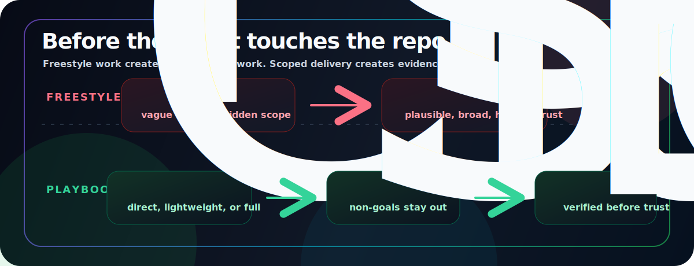

# Agentic Delivery Playbook

**A no-hype workflow for keeping coding agents scoped, testable, and honest.**

This is the thing you paste before you let an agent touch your repo.

Use it to classify the task, define what the agent may change, choose the right model or agent when your harness allows it, and require evidence before trusting the result.

Start with one prompt. Add templates and run artifacts only when the task is risky enough to deserve them.

<p align="center">
  
</p>

## Try it in 60 seconds

Paste this into Claude Code, Codex, ChatGPT, Claude, Cursor, or another coding assistant:

```text
Use the Agentic Delivery Playbook.

First classify this task:
- direct: clear, low-risk, narrow edit; no spec or run directory
- lightweight: bounded work that needs a compact checklist/spec
- full: broad, ambiguous, security/privacy/provider/state/API, or drift-prone work

Use the smallest safe process.

If direct:
- make the smallest correct change
- run the obvious validation
- report changed files and evidence

If lightweight or full:
- draft a compact spec before coding
- include objective, non-goals, acceptance criteria, risks, and verification
- stop for my approval before implementation unless I say continue end-to-end
- after implementation, QA the diff against the spec, not your own summary
- do not claim tests passed unless you have actual output

Task:
<describe the task>
```

That is the whole starting point. Everything else in this repo is for teams that want the repeatable version.

## What problem does this solve?

| Agent pain | Playbook move |
| --- | --- |
| “The agent changed too much.” | Direct/lightweight/full triage before editing |
| “It solved a different problem.” | Approved spec with non-goals |
| “I do not trust the test summary.” | Evidence-based closeout |
| “The PR is hard to review.” | QA against acceptance criteria, not summaries |
| “The model was too weak or too expensive for the job.” | Model/agent routing ledger when available |
| “The task keeps going sideways.” | Fix-cycle escalation rules |

## The three modes

Choose process weight before creating artifacts.

| Mode | Use when | What happens |
| --- | --- | --- |
| **Direct** | Small, obvious, low-risk change | Edit, validate, report evidence |
| **Lightweight** | Bounded feature/fix needing a checklist | Compact spec, approval, implementation, QA |
| **Full** | Risky, ambiguous, cross-system, security/privacy/API/state/provider work | Critic, approval gate, QA evidence, escalation rules |
| **Full + bounded workflow** | Broad audit, migration, or adversarial review | Parallel or dynamic work only with scope, cap, stop rule, and synthesis plan |

Do not use full mode for tiny direct edits. Do not create artifacts for obvious one-file changes.

## Adopt it in five minutes

1. Paste the 60-second prompt into your next agent task.
2. Ask the agent to classify the task before editing.
3. For direct tasks, let it edit and require evidence.
4. For non-direct tasks, approve the spec before implementation.
5. Use a QA prompt on the final diff: “Verify this diff against the approved spec, not the implementer summary.”

No framework required. No new service required. No agent platform required.

## The loop

```text
classify -> spec only if needed -> approve -> implement -> QA against evidence
```

For full-mode work, the complete loop is:

```text
intake -> spec -> critique -> approval -> implementation -> QA -> fix/escalate -> closeout
```

<p align="center">
  
</p>

## What this is not

This is not another agent framework.

It does not require a new runtime, queue, orchestrator, vector database, dashboard, or multi-agent platform.

You can use it as:

- one pasted prompt
- a Claude Code command or project memory
- a Codex `AGENTS.md`
- a ChatGPT/Claude review checklist
- a repo-local delivery convention

Start with the prompt. Add artifacts only when the task deserves them.

## Designed to control token waste

The playbook does not assume one model should do everything.

Use stronger reasoning where mistakes are expensive: goal definition, spec writing, critique, edge cases, safety review, QA, and escalation. Use faster or cheaper implementation agents after the task is explicit and small enough. Record intended and actual model/agent choices when your harness exposes them.

This is a design goal, not a magic savings claim. To make cost and quality inspectable, runs can record:

- task mode and approved scope
- intended vs actual model/agent routing
- validation commands and outputs
- QA findings and fix cycles
- known gaps and next action

See [`docs/model-routing.md`](docs/model-routing.md) for the routing ledger and role guidance.

## Why not just prompt better?

Better prompts ask the agent to be careful.

This playbook makes care inspectable:

- What was approved?
- What changed?
- What evidence exists?
- Did the agent drift?
- Should we retry, split, escalate, or stop?

That matters when the code is production-facing, security-sensitive, expensive to review, or easy to get subtly wrong.

## Use with your tool

Start with [`docs/getting-started.md`](docs/getting-started.md). It includes:

- the universal prompt for any assistant
- Claude and ChatGPT prompts for spec review and QA
- Claude Code `CLAUDE.md` and slash-command setup
- Codex `AGENTS.md` setup

See [`docs/dynamic-workflows.md`](docs/dynamic-workflows.md) for bounded fanout, width-vs-depth guidance, and workflow launch notes.
If you run Hermes or Pi with OpenAI-backed browser-login models, see [`docs/openai-hermes-pi-routing.md`](docs/openai-hermes-pi-routing.md) for a surface-specific routing companion.

## Artifact quick start for non-direct runs

If the task is direct mode, skip this section: make the edit, run the obvious validation, and report changed files plus evidence.

For lightweight or full mode:

1. Create a run directory:

   ```text
   specs/YYYYMMDD-HHMM-feature-slug/
   ```

2. Copy the templates:

   ```text
   templates/spec.template.md   -> specs/.../spec.md
   templates/spec.template.html -> specs/.../spec.html  # optional visual spec
   templates/run.template.json  -> specs/.../run.json
   templates/notes.template.md  -> specs/.../notes.md
   ```

3. Fill the spec before implementation. Keep lightweight specs compact; use HTML, diagrams, or images only when they help the human reviewer actually understand the contract before approving it.
4. Critique and revise the spec. Lightweight mode can use parent self-review; full mode should use a critic when available.
5. Get human approval.
6. Choose the implementation model or agent for the focused task, recording reasoning controls when available.
7. Give the implementer the approved spec and nothing vague.
8. QA the diff against the spec. Use high-risk QA for full-mode sensitive or cross-system work.
9. Close out with evidence, model routing, known gaps, and the next action.

See [`playbook.md`](playbook.md) for the full workflow.

## Repository layout

```text
README.md
playbook.md
SECURITY.md
assets/
  scoped-vs-freestyle.svg
  agentic-delivery-loop.svg
docs/
  philosophy.md
  gates.md
  model-routing.md
  dynamic-workflows.md
  openai-hermes-pi-routing.md
  getting-started.md
  tool-quickstart.md  # compatibility redirect
  failure-modes.md
  high-risk-qa.md
  visual-specs.md
  adapters.md
  publishing.md
templates/
  spec.template.md
  spec.template.html
  run.template.json
  notes.template.md
  qa-checklist.template.md
  closeout-governance.template.md
adapters/
  chatgpt/
    README.md
    instructions.md
  claude/
    SKILL.md
    workflow.md
  codex/
    AGENTS.md
    README.md
  pi/
    SKILL.md
examples/
  lightweight-ticket/
    spec.md
    run.json
    notes.md
.github/
  ISSUE_TEMPLATE/
  pull_request_template.md
```

## Use with Claude, Claude Code, ChatGPT, or Codex

For Claude, install the self-contained skill in `adapters/claude/` when your environment supports skills. For prompt-only or project-instruction setups, use the setup snippets in [`docs/getting-started.md`](docs/getting-started.md). It covers:

- Claude skill installation and prompt-only review usage
- Claude Code project memory and slash-command setup
- ChatGPT as spec author, critic, or QA reviewer
- Codex `AGENTS.md` instructions or copy/paste session prompts

## Install adapters

ChatGPT adapter:

```text
adapters/chatgpt/
  README.md
  instructions.md
```

ChatGPT does not currently use Claude-style skill folders. Use `adapters/chatgpt/instructions.md` as ChatGPT Project instructions, custom GPT instructions, or a pasted session instruction.

Claude skill adapter:

```text
adapters/claude/
  SKILL.md
  workflow.md
```

Install it with `npx`:

```bash
# User skill, available across projects
npx agentic-delivery-playbook install claude

# Or project skill, available in one repo
npx agentic-delivery-playbook install claude --project
```

Until the package is published to npm, install from GitHub:

```bash
npx github:arcayne/agentic-delivery-playbook install claude
```

The installer copies the whole `adapters/claude/` directory into the selected Claude skills location. The skill command name comes from the install directory, for example `/agentic-delivery-playbook`. If your Claude environment uses upload/import instead of local skill folders, upload the whole `adapters/claude/` folder, not just `SKILL.md`.

Codex adapter:

```text
adapters/codex/
  AGENTS.md
  README.md
```

Install it by copying `adapters/codex/AGENTS.md` into the target repository root, or merge it into an existing `AGENTS.md`.

Pi skill adapter:

```text
adapters/pi/SKILL.md
```

Project-local Pi install example:

```bash
mkdir -p .pi/skills/agentic-delivery-playbook
cp /path/to/agentic-delivery-playbook/adapters/pi/SKILL.md \
  .pi/skills/agentic-delivery-playbook/SKILL.md
```

The adapters are intentionally generic. Configure your preferred models or agents in your own harness instead of relying on hard-coded model names.

## Core principle

Use strong reasoning for shared understanding, edge cases, acceptance criteria, and QA contracts. Use implementation agents only after the contract is clear. Evaluate the result against evidence.

If the spec is complex, make it readable. A rendered HTML spec, diagram, or screenshot is useful when it helps the human reviewer catch mistakes instead of blindly approving an agent plan.

## Publishing checklist

Recommended GitHub description:

```text
No-hype workflow for keeping coding agents scoped, testable, and honest.
```

Recommended topics:

```text
ai-agents, coding-agents, agentic-workflow, spec-first,
software-engineering, ai-assisted-development, human-in-the-loop
```

See [`docs/publishing.md`](docs/publishing.md) for first-publish and release commands.

## Status

`v0.2.0` draft. Adds evidence integrity, lightweight/broad budget awareness, and portable observability/ROI closeout guidance while keeping the pattern intentionally practical.

## License

MIT. See [`LICENSE`](LICENSE).
