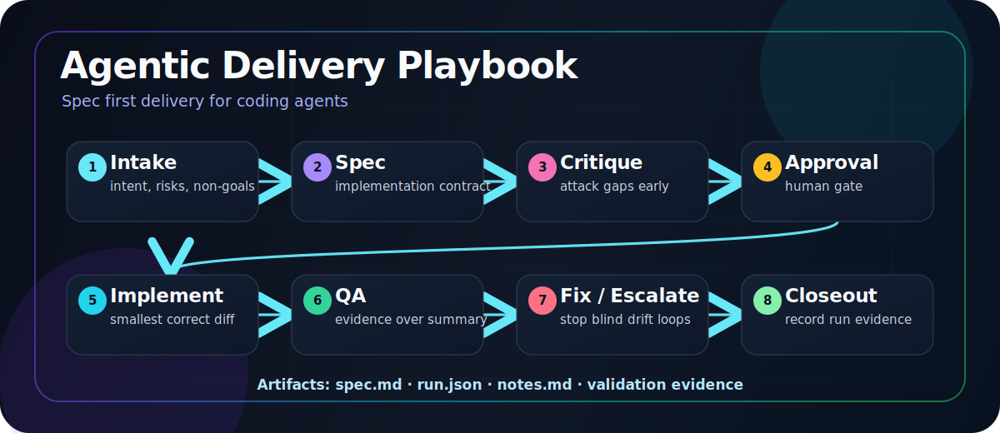

# Agentic Delivery Playbook

A spec first workflow for coding agents: choose the right model per task, use strong reasoning early, split work into smaller tickets, reduce drift, retries, and spend.

<p align="center">
  
</p>

The idea is simple: decide which model or agent should handle each phase. Spend stronger reasoning early on the spec, critique, edge cases, and acceptance criteria; then give implementation agents smaller, clearer tasks that are cheaper to run, easier to review, and less likely to drift.

Coding agents are powerful, but they are easiest to trust when intent, constraints, and verification are explicit before they edit code. This playbook turns agentic coding into an auditable delivery loop:

```text
intake -> spec -> critique -> approval -> implementation -> QA -> fix/escalate -> closeout
```

The goal is not to add ceremony to every change. The goal is to use the right amount of structure when agent drift, ambiguous requirements, security/privacy risk, or cross-system changes would be expensive.

## What this is

This repository is a portable engineering pattern for operating coding agents on real software work. It defines:

- role separation: spec author, critic, implementer, QA reviewer, human approver
- approval gates before implementation
- implementation against an accepted contract
- QA against evidence, not summaries
- explicit model or agent choice per task: spec, critique, implementation, QA, escalation
- run artifacts that record decisions, validation, model routing, and known gaps
- escalation rules when an agent drifts or repeated fix cycles appear

## Why not just prompt better?

Better prompts help. Delivery systems help more.

A prompt can ask an agent to be careful. A delivery workflow makes care inspectable: what was approved, what changed, what evidence exists, where the agent drifted, and when the loop should stop or escalate.

This playbook is for the gap between casual AI assisted editing and production like engineering discipline.

## When to use it

Choose process weight before creating artifacts.

Use **direct mode** for clear, low-risk one- or two-file edits: no run directory, just edit, validate, and report evidence.

Use **lightweight mode** for bounded low/medium-risk work that benefits from a compact spec or checklist. Notes-only evidence and parent self-review are acceptable when risk stays low.

Use **full mode** for ambiguous, risky, cross-package, customer-facing, provider/config/state-machine, security/privacy, or drift-prone work. Full mode uses broad-ticket planning when needed, explicit routing ledgers, critic/QA gates, high-risk QA, and required closeout fields.

Do not use the full workflow for tiny direct edits unless the user explicitly asks for a spec-first run.

## Model choice per task

This playbook does not assume one model should do everything.

Use stronger reasoning for high ambiguity work: intake, spec writing, critique, architecture tradeoffs, safety review, and escalation. Use faster or cheaper implementation agents after the spec is clear and the task has been split small enough. Use skeptical reviewers for QA.

Every run should record the intended and actual model or agent for each role. That makes cost, quality, and drift visible instead of hidden inside a chat transcript.

See [`docs/model-routing.md`](docs/model-routing.md) for the routing ledger and role guidance.
If you run Hermes or Pi with OpenAI-backed browser-login models, see [`docs/openai-hermes-pi-routing.md`](docs/openai-hermes-pi-routing.md) for a surface-specific routing companion.

## Quick start for non-direct runs

If the task is direct mode, skip this section: make the edit, run the obvious validation, and report changed files plus evidence.

For lightweight or full mode:

1. Create a run directory:

   ```text
   specs/YYYYMMDD-HHMM-feature-slug/
   ```

2. Copy the templates:

   ```text
   templates/spec.template.md   -> specs/.../spec.md
   templates/spec.template.html -> specs/.../spec.html  # optional visual spec
   templates/run.template.json  -> specs/.../run.json
   templates/notes.template.md  -> specs/.../notes.md
   ```

3. Fill the spec before implementation. Keep lightweight specs compact; use HTML, diagrams, or images only when they help the human reviewer actually understand the contract before approving it.
4. Critique and revise the spec. Lightweight mode can use parent self-review; full mode should use a critic when available.
5. Get human approval.
6. Choose the implementation model or agent for the focused task, recording reasoning controls when available.
7. Give the implementer the approved spec and nothing vague.
8. QA the diff against the spec. Use high-risk QA for full-mode sensitive or cross-system work.
9. Close out with evidence, model routing, known gaps, and the next action.

See [`playbook.md`](playbook.md) for the full workflow.

## Repository layout

```text
README.md
playbook.md
SECURITY.md
assets/
  agentic-delivery-loop.svg
docs/
  philosophy.md
  gates.md
  model-routing.md
  openai-hermes-pi-routing.md
  failure-modes.md
  high-risk-qa.md
  visual-specs.md
  adapters.md
  publishing.md
templates/
  spec.template.md
  spec.template.html
  run.template.json
  notes.template.md
  qa-checklist.template.md
  closeout-governance.template.md
adapters/
  pi/
    SKILL.md
examples/
  lightweight-ticket/
    spec.md
    run.json
    notes.md
.github/
  ISSUE_TEMPLATE/
  pull_request_template.md
```

## Install as a Pi skill

If you use the Pi coding agent, install the adapter from:

```text
adapters/pi/SKILL.md
```

Project-local install example:

```bash
mkdir -p .pi/skills/agentic-delivery-playbook
cp /path/to/agentic-delivery-playbook/adapters/pi/SKILL.md \
  .pi/skills/agentic-delivery-playbook/SKILL.md
```

The adapter is intentionally generic. Configure your preferred models or agents in your own harness instead of relying on hard-coded model names.

## Core principle

Use strong reasoning for shared understanding, edge cases, acceptance criteria, and QA contracts. Use implementation agents only after the contract is clear. Evaluate the result against evidence.

If the spec is complex, make it readable. A rendered HTML spec, diagram, or screenshot is useful when it helps the human reviewer catch mistakes instead of blindly approving an agent plan.

## Publishing checklist

Recommended GitHub description:

```text
Spec first workflow for coding agents: choose the right model per task, use strong reasoning early, split work into smaller tickets, reduce drift, retries, and spend.
```

Recommended topics:

```text
ai-agents, coding-agents, agentic-workflow, spec-first,
software-engineering, ai-assisted-development, human-in-the-loop
```

See [`docs/publishing.md`](docs/publishing.md) for first-publish and release commands.

## Status

`v0.2.0` draft. Adds evidence integrity, lightweight/broad budget awareness, and portable observability/ROI closeout guidance while keeping the pattern intentionally practical.

## License

MIT. See [`LICENSE`](LICENSE).
