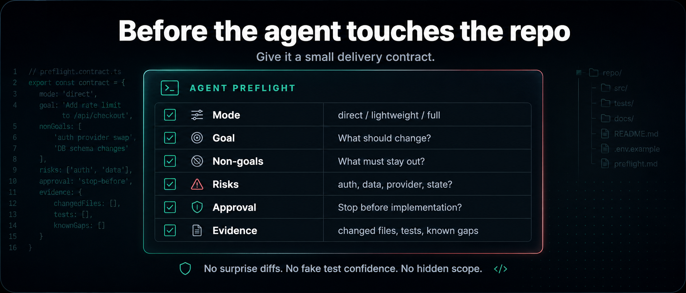

# Agentic Delivery Playbook

[](LICENSE)
[](CHANGELOG.md)
[](package.json)

**A Pi-native preflight and closeout skill for keeping coding agents scoped, testable, and honest.**

> Before Pi or another coding agent edits your repo, give it a small delivery contract.

<p align="center">
  
</p>

A practical safety harness for Pi coding sessions: classify the task, lock the scope, coordinate goals/subagents when useful, stop risky work before implementation, route honestly, and close out with evidence.

Built and dogfooded in Pi. Portable adapters are included for Claude, Codex, and ChatGPT.

**Start here:** [Getting started](docs/getting-started.md) · [Pi skill](adapters/pi/SKILL.md) · [Templates](templates/) · [Example run](examples/lightweight-ticket/) · [Security](SECURITY.md) · [Contributing](CONTRIBUTING.md)

## Try it in 60 seconds

In Pi:

```text
/skill:agentic-delivery-playbook <describe the task>
```

Or paste this into Pi, Claude Code, Codex, ChatGPT, Claude, Cursor, or another coding assistant:

```text
Use the Agentic Delivery Playbook.

First classify this task:
- direct: clear, low-risk, narrow edit; no spec or run directory
- lightweight: bounded work that needs a compact checklist/spec
- full: broad, ambiguous, security/privacy/provider/state/API, or drift-prone work

Use the smallest safe process.

If direct:
- make the smallest correct change
- run the obvious validation
- report changed files and evidence

If lightweight or full:
- draft a compact spec before coding
- include objective, non-goals, acceptance criteria, risks, and verification
- stop for my approval before implementation unless I say continue end-to-end
- after implementation, QA the diff against the spec, not your own summary
- do not claim tests passed unless you have actual output

Task:
<describe the task>
```

That is the fastest way to get value from this repo. Everything else here helps you make that behavior repeatable across Pi and other agent tools.

## Why this exists

Coding agents are useful, but they drift:

- vague prompts turn into broad diffs
- non-goals get silently included
- validation gets summarized instead of proven
- retries pile up because the target keeps moving
- review gets harder because the agent narrates confidence instead of showing evidence

This playbook gives Pi, or another coding agent, a small delivery contract before it edits.

## What this gives you

| Agent problem | Playbook guardrail |
| --- | --- |
| Agent changes too much | Pick direct/lightweight/full before editing |
| Agent solves the wrong problem | Write goal and non-goals before implementation |
| Agent claims tests passed | Require commands, output, and known gaps |
| Agent keeps retrying blindly | Use fix/escalation rules |
| PR is hard to review | QA against acceptance criteria, not summaries |
| Risky task starts coding too early | Add an approval gate |
| Expensive model is used for everything | Route stronger reasoning to spec/QA work only when it helps |
| Full-mode work still uses one parent model | Use Pi goals for lifecycle and subagents for worker/reviewer separation |

## Agent Preflight

Before implementation, define:

- **Mode** — direct, lightweight, or full
- **Goal** — the thing that should become true
- **Non-goals** — what must not be touched
- **Risks** — security, money, auth, data loss, provider behavior, hidden coupling
- **Approval** — whether the agent must stop before implementation
- **Evidence** — what proof is required at closeout

That checklist is the core artifact. The playbook exists to make it easy to use consistently.

## Demo: turn a vague request into a delivery contract

Bad:

```text
Fix the webhook bug.
```

Better:

```text
Use the Agentic Delivery Playbook.

Classify the task first.

Goal:
Fix duplicate webhook processing.

Non-goals:
- Do not change billing plans.
- Do not refactor unrelated handlers.
- Do not change DB schema unless required and explained.

Risks:
payment state, provider retries, idempotency

Approval:
Stop before implementation.

Evidence:
Show changed files, tests run, output, and known gaps.
```

That is the move: make the agent operate against a concrete contract, not an abstract intention.

## The three modes

Choose process weight before creating artifacts.

| Mode | Use when | What happens |
| --- | --- | --- |
| **Direct** | Small, obvious, low-risk change | Edit, validate, report evidence |
| **Lightweight** | Bounded feature or fix that needs a checklist | Compact spec, approval if needed, implementation, QA |
| **Full** | Risky, ambiguous, cross-system, security/privacy/API/state/provider work | Critique, approval gate, QA evidence, escalation rules |
| **Full + bounded workflow** | Broad audit, migration, or adversarial review | Parallel or dynamic work only with scope, caps, stop rules, and synthesis |

Do not create heavy artifacts for obvious one-file fixes. Do not let risky work skip approval and evidence.

## Pi-native workflow

The playbook is the policy layer. It coordinates existing Pi primitives:

```text
agentic-delivery-playbook = triage, scope, approval, evidence policy
pi-goal-x                 = durable lifecycle for broad/long-running work
pi-subagents              = scoped implementation and review lanes
run artifacts             = evidence trail only when useful
```

For Full mode, the expected shape is: parent drafts/approves scope, one focused `worker` or several non-overlapping slice workers perform implementation, a `reviewer` checks the diff against the contract, and a Pi goal is used when the work is broad, long-running, or explicitly goal-driven. See [`docs/pi-native-workflow.md`](docs/pi-native-workflow.md).

If you expect different model lanes for worker/reviewer/planner, configure `.pi/settings.json`; see [`templates/pi-settings.template.json`](templates/pi-settings.template.json).

### Parallel slices for big approved work

When the user approves a whole PRD/goal or says they want the whole outcome, the parent agent can batch independent child slices through Pi subagents instead of sending one giant implementation prompt.

The parent must still own scope and evidence:

1. choose a recursive decomposition strategy before workers write: coarse launch tree, dependencies, caps, and first safe slice(s)
2. keep root planning lightweight by default; do not require the first planner to map every downstream file before the first slice starts
3. give each launched worker a bounded slice contract with allowed files, forbidden files, non-goals, route, dependencies, validation, and an ownership/conflict rule
4. protect shared files for siblings launching now: nav/i18n/router/schema/config/lockfile files are single-owner, serialized, or isolated in worktrees with a merge barrier
5. let each planner that decomposes a still-broad slice propose a local subtree map, while the parent/orchestrator approves recursion depth, launch, and synthesis
6. keep product and architecture decisions in the parent; child agents stop and escalate ambiguity instead of deciding
7. enforce route/model rules per slice; Full child slices need verified route or an approved exception
8. treat timeouts as failed gates; partial edits from a timed-out worker are untrusted until reviewed or completed by an approved route
9. require child-local validation plus parent-level global validation after synthesis
10. avoid parallelizing sequential UX flows; slice by independent surfaces, packages, fixtures, or acceptance-criteria clusters

If no safe parallel slices exist yet, launch one narrow serialized worker for the next slice. A single worker for the entire PRD/spec should be recorded as an explicit exception with a context-risk mitigation plan.

Record the launch note, recursion/concurrency cap, conflict rule for the active launch, barrier plan, status dashboard, and PRD implementation ledger in `run.json`/`notes.md`. The ledger maps each PRD requirement to a slice, status, evidence, remaining gap, and next gate so the run can answer "where are we in the PRD?" without reading every report. See [`docs/dynamic-workflows.md`](docs/dynamic-workflows.md) and [`templates/child-task.md`](templates/child-task.md).

## Use it with Pi first

Install the Pi skill globally:

```bash
npx github:arcayne/agentic-delivery-playbook install pi
```

Then start a fresh Pi session and run:

```text
/skill:agentic-delivery-playbook <your task>
```

Project-local install:

```bash
npx github:arcayne/agentic-delivery-playbook install pi --project
```

The Pi skill is a value gate, not a forced spec-first mode. It should change behavior by making scope, approval, routing truth, or evidence clearer. If it would only add ceremony, use Direct mode.

## Portable adapters

Start with [`docs/getting-started.md`](docs/getting-started.md). It includes:

- Pi skill setup and command usage
- universal prompt-only usage for any assistant
- Claude and ChatGPT prompts for spec review and QA
- Claude Code project-memory and slash-command setup
- Codex `AGENTS.md` setup

Repo adapters:

- [`adapters/pi/`](adapters/pi/) — primary Pi skill
- [`adapters/claude/`](adapters/claude/) — Claude skill port
- [`adapters/codex/`](adapters/codex/) — Codex repo instructions
- [`adapters/chatgpt/`](adapters/chatgpt/) — ChatGPT Project/custom-GPT instructions

For model routing, bounded fanout, and handoff economics, see [`docs/model-routing.md`](docs/model-routing.md), [`docs/dynamic-workflows.md`](docs/dynamic-workflows.md), and [`docs/handoff-economics.md`](docs/handoff-economics.md).

## When to add templates and run artifacts

If the task is **direct**, skip this section.

If the task is **lightweight** or **full**:

1. create a run directory like `specs/YYYYMMDD-HHMM-feature-slug/`
2. copy the needed files from [`templates/`](templates/)
3. write the spec before coding
4. get approval when the task is risky enough to require it
5. implement against the approved spec
6. QA the diff against the spec
7. close out with evidence, known gaps, and next action

See [`playbook.md`](playbook.md) for the full workflow and [`examples/lightweight-ticket/`](examples/lightweight-ticket/) for a completed small-run example.

## What is in this repo

- [`adapters/pi/SKILL.md`](adapters/pi/SKILL.md) — primary Pi skill
- [`playbook.md`](playbook.md) — full portable workflow
- [`docs/getting-started.md`](docs/getting-started.md) — setup and usage
- [`docs/pi-native-workflow.md`](docs/pi-native-workflow.md) — how the skill layers Pi goals, subagents, and artifacts
- [`docs/gates.md`](docs/gates.md) — approval and escalation rules
- [`docs/failure-modes.md`](docs/failure-modes.md) — common agent failure patterns
- [`docs/high-risk-qa.md`](docs/high-risk-qa.md) — QA for sensitive changes
- [`docs/visual-specs.md`](docs/visual-specs.md) — when visuals help spec review
- [`templates/`](templates/) — reusable spec, run, notes, QA, and Pi settings templates
- [`examples/`](examples/) — copyable examples of finished artifacts
- [`docs/adapters.md`](docs/adapters.md) — tool-specific integration notes

## Install adapters

### Pi skill

```bash
# User skill, available across projects
npx agentic-delivery-playbook install pi

# Or project skill, available in one repo
npx agentic-delivery-playbook install pi --project
```

Until the package is published to npm, install from GitHub:

```bash
npx github:arcayne/agentic-delivery-playbook install pi
```

In Pi, load it with:

```text
/skill:agentic-delivery-playbook <task>
```

or prompt normally: `Use agentic-delivery-playbook for <task>`. The bare `/agentic-delivery-playbook` form is for Claude-style skill environments, not Pi.

### Claude skill port

```bash
npx agentic-delivery-playbook install claude
npx agentic-delivery-playbook install claude --project
```

Until the package is published to npm:

```bash
npx github:arcayne/agentic-delivery-playbook install claude
```

### Codex adapter

Copy [`adapters/codex/AGENTS.md`](adapters/codex/AGENTS.md) into the target repository root, or merge it into an existing `AGENTS.md`.

### ChatGPT adapter

Use [`adapters/chatgpt/instructions.md`](adapters/chatgpt/instructions.md) as project instructions, custom GPT instructions, or a pasted session instruction.

## What this is not

This is not a new agent runtime, orchestrator, queue, dashboard, or multi-agent platform.

It is a lightweight delivery convention you can use as:

- a Pi skill
- one pasted prompt
- a repo-level instructions file
- a Claude skill port
- a Codex `AGENTS.md`
- a review checklist for ChatGPT, Claude, or Pi

## Status

`v0.2.0` draft. Current focus: keep the playbook concrete, lightweight, and easy to adopt before adding more process.

## License

MIT. See [`LICENSE`](LICENSE).
